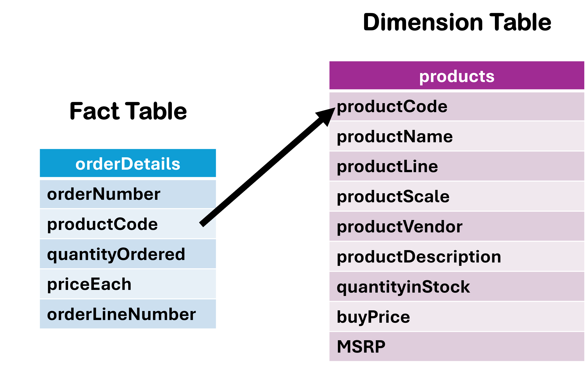

# Lab Submission

## Team Members

1. Name, Student ID, Class Group
2. Name, Student ID, Class Group
3. Name, Student ID, Class Group
4. Name, Student ID, Class Group
5. Name, Student ID, Class Group

## Section 1: Deduplication Strategies

Write your 800 - 1,000 word essay here as per the instructions provided in the lab manual.

## Section 2: Additional Data Ingestion

Ingest more data into the following:

1. Fact table: `orderDetails`

2. Dimension table: `products`

**Part A:** Add code for creating the additional fact and dimension tables in ClickHouse. The code should be added here: [container-volumes/clickhouse/ClickHouseTables.sql](container-volumes/clickhouse/ClickHouseTables.sql)

**Part B:** Update the Kafka source connector to support this ingestion using a Change Data Capture source connector. The updated code should be placed here: [kafka-connector-configs/submit_source-mysql-classicmodels-00_config.sh](kafka-connector-configs/submit_source-mysql-classicmodels-00_config.sh)

**Part C:** Add sink connectors to support the ingestion. There should be 3 sink connectors to insert, update, and delete into `orderDetails` and 3 sink connectors to insert, update, and delete into `products`. Place the 6 sink connectors in the `kafka-connector-configs` folder.

**Part D:** Provide screenshots below to show that the data pipeline has been created and the ingestion is successful.
